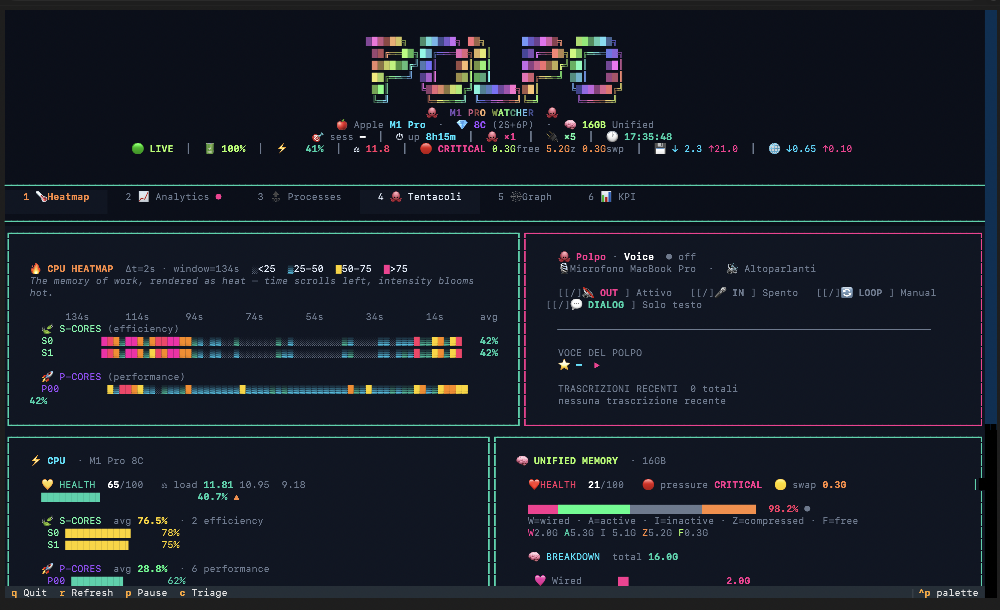
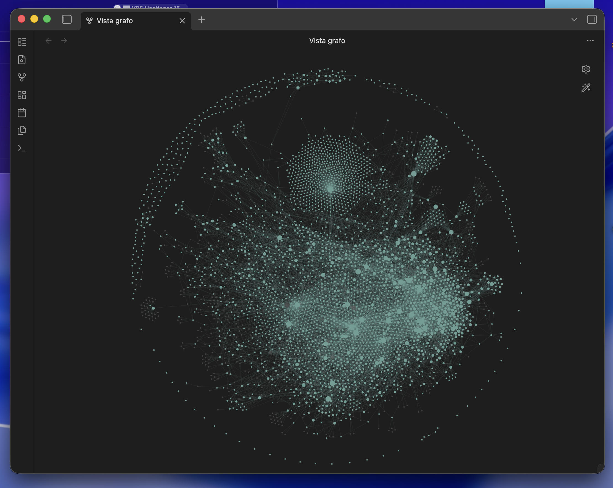
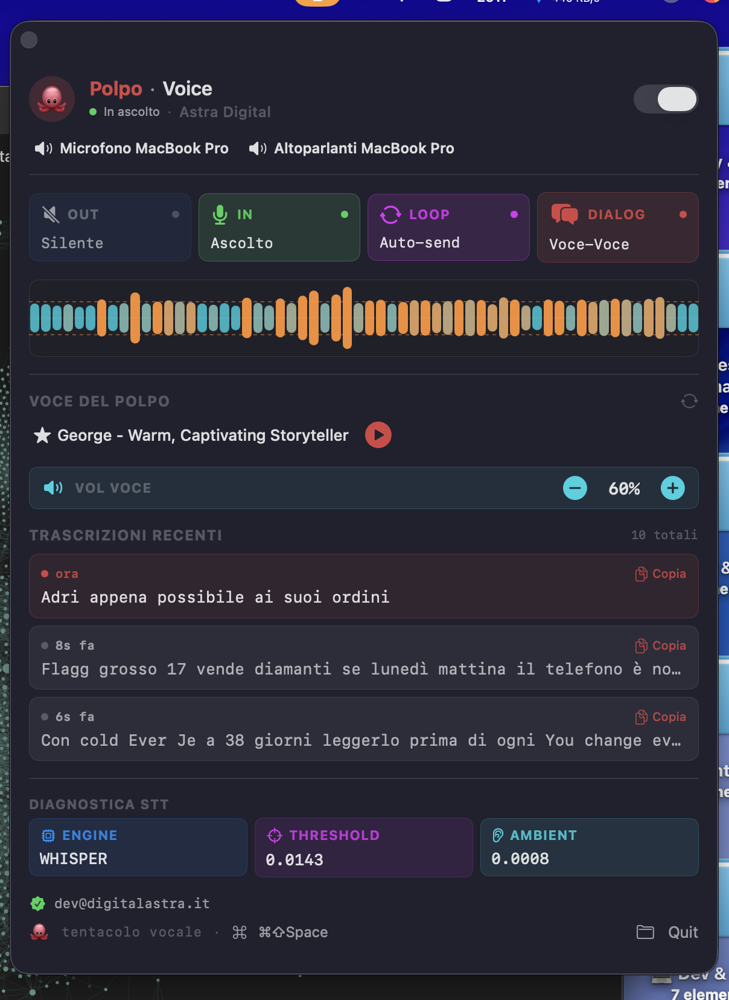

# 🐙 M5 Max Watcher

> **Real-time terminal dashboard (TUI) for Apple M5 Max** — CPU per-core heatmap,
> unified memory pressure, top processes, and Polpo background process map,
> all in a beautiful Textual cockpit running natively on macOS Apple Silicon.


<div align="center">


</div>

**Version:** 2.4.0 · **Codename:** Polpo Data Viz Edition · **Released:** 2026-05-03
**Author:** Mattia Calastri · **Company:** Astra Digital Marketing
**Pillar:** Astra OS · Polpo Cockpit Suite · **Forged in:** sess.1238 · sess.1253 · sess.1269 · sess.1279 · sess.1301 · sess.1302 · sess.1346 · sess.1350 · sess.1376 · sess.1465

---

## Screenshots

<div align="center">

### 🌡 Heatmap — CPU cores · Voice panel · Unified Memory


<br/>

| 🕸 Vault Knowledge Graph | 🐙 Polpo Voice panel |
|:---:|:---:|
|  |  |

</div>

---

## What it does

M5 Max Watcher is a Textual-based terminal UI that streams live observability
data from your Apple Silicon M5 Max:

- **CPU** per-core (6 efficiency + 12 performance) with sub-pixel smooth bars
- **Unified memory** breakdown — wired / active / inactive / compressed / free
- **Temporal heatmap** of all 18 cores (88s rolling window, Δt=2s)
- **Statistics** min/avg/p95/max + P/S efficiency ratio + 2-min sparklines
- **Top processes** by CPU + RAM
- **Tentacoli** — Polpo background process map (Claude sessions, MCP servers,
  Jarvis voice daemon, watchdogs, dashboards)
- **Vault Intelligence Panel** — Neural Density cockpit, wikilink graph, Data Attractors, Topologia
- **KPI panel** — business vitals live from vault (MRR, outstanding, pipeline, setter metrics)
- **Process Triage Advisor** — 40+ pattern KB with KILL_SAFE / CAUTIOUS / KEEP classification
- **Header rich-info** — session number, uptime, claude×N, mcp×N, time, status

## Design philosophy

- **Data viz first** — every glyph, color, emoji is a semantic anchor
- **Polpo Design System** — pastel rainbow ad onda title with HSV wave +
  luminosity sin modulation
- **Energy palette** — LIME · ELEC_BLUE · DEEP_PURPL · HOT_PINK · ORANGE ·
  SOFT_GREEN · WHITE
- **Hierarchy explicit** — H1 rainbow → H2 colored emoji → H3 cluster →
  critical values WHITE bold → body semantic-colored → chrome DIM

## Tabs

| Tab | Content |
|---|---|
| 🌡 Heatmap | Temporal core heatmap (S-cluster 🍃 + P-cluster 🚀) + **Polpo Voice panel** |
| 📈 Analytics | Stats min/avg/p95/max + P/S ratio + 2-min sparklines |
| 🔝 Processes | Top 16 by CPU + RAM |
| 🐙 Tentacoli | Polpo background processes map |
| 🕸 Graph | Vault Intelligence Panel — Neural Density cockpit, Data Attractors, Topologia |
| 📊 KPI | Business vitals — MRR, outstanding, pipeline weighted, setter metrics |

**Polpo Voice panel** (Heatmap tab, right column): mirrors JarvisToggle.app — OUT/IN/LOOP/DIALOG state pills,
waveform sparkline from `stt_levels.bin`, active voice name, last 10 transcriptions.

## Keybindings

| Key | Action |
|---|---|
| `q` | Quit |
| `r` | Force refresh |
| `p` | Toggle pause |
| `1` `2` `3` `4` `5` `6` | Switch tab (Heatmap / Analytics / Processes / Tentacoli / Graph / KPI) |
| `c` | Open Process Triage Advisor modal |
| `f` | Cycle graph filter (all / moc / orphan) |
| Click `+` `−` (bottom-right) | Zoom Ghostty terminal (delegates `Cmd+`/`Cmd-`) |

## Installation

```bash
cd ~/projects/m5-watcher
python3 -m venv venv
venv/bin/pip install -r requirements.txt
./run.sh
```

Or launch dedicated Ghostty window:

```bash
open -na Ghostty.app --args -e ~/projects/m5-watcher/run.sh
```

**Custom vault path** (Tab 🕸 Graph reads your Obsidian vault):

```bash
export M5_VAULT_PATH="/path/to/your/obsidian/vault"
./run.sh
```

## Architecture

```
m5-watcher/
├── app.py               # main Textual app — TUI, all widgets, voice panel, triage modal
├── data_sources.py      # psutil/sysctl wrappers — pure data layer + triage KB
├── vault_parser.py      # wikilink extractor → NetworkX DiGraph + Neural Density
├── graph_widget.py      # Vault Intelligence Panel renderer (Rich markup)
├── kpi_widget.py        # KPI tab — reads KPI.md frontmatter for business vitals
├── test_suite.py        # comprehensive test suite (all modules)
├── polpo.tokens.json    # Polpo Design System palette
├── requirements.txt     # textual + psutil + networkx pinned
├── run.sh               # launcher
└── README.md            # this file

# Polpo Voice data (runtime, read-only — written by Jarvis):
~/.local/run/jarvis/
├── stt_state            # current state: speaking / listening / idle
├── stt_levels.bin       # float32 audio levels stream
├── stt_history.jsonl    # transcription history (last N entries)
├── voice_selected       # active voice id
└── voices.json          # voice display names

# Obsidian vault (runtime, read-only — for Tab 5 🕸 Graph):
# Set M5_VAULT_PATH env var to your vault root (default: ~/Library/Mobile Documents/iCloud~md~obsidian/Documents/Vault)
# vault_parser.py scans *.md recursively, cache TTL 60s
```

**Refresh cadence:**
- Fast (2s): per-core CPU, history, heatmap, analytics, header status
- Slow (5s): unified memory, battery, top processes, tentacoli, claude+mcp count, vault graph

**Data sources:** `data_sources.py` pure wrapper around `psutil` + `sysctl`,
no async I/O. `vault_parser.py` runs via `asyncio.to_thread` (non-blocking).

## Tests

```bash
cd ~/projects/m5-watcher
venv/bin/python test_suite.py
```

Comprehensive suite across multiple classes — covers syntax, deps, all data sources, all renderers,
vault_parser (live + error path), graph_widget (all filter modes), headless Textual
compose + tab switch 1-6 + pause toggle + triage KB.

## Visual language

| Color | Meaning |
|---|---|
| 🟢 `LIME` `#a8ff60` | alive / free RAM / S-cluster signature |
| 🔵 `ELEC_BLUE` `#00e5ff` | live / cpu / electric flow |
| 💜 `DEEP_PURPL` `#9d4dff` | P-cluster (performance) |
| 🌸 `HOT_PINK` `#ff2d92` | spike / write / attention |
| 🟧 `ORANGE` `#ff8a3d` | warm warning / compressed / heat |
| 🍃 `SOFT_GREEN` `#5dffaa` | S-cluster soft signature |
| ⚪ `WHITE` `#ffffff` | critical headlines (HEALTH score, sess number) |

## Trend glyphs

| Glyph | Meaning |
|---|---|
| `▲▲` HOT_PINK | rising fast (>+4/sample) |
| `▲` ORANGE | rising (>+1.5/sample) |
| `●` DIM | stable |
| `▼` SOFT_GREEN | descending (<-1.5/sample) |
| `▼▼` LIME | descending fast (<-4/sample) |

## Health scoring

`(100 - cpu) × 0.35 + (100 - ram) × 0.45 + (100 - load/N_CORES × 100) × 0.20`

Visual badge: 💚 ≥80 · 💛 ≥60 · 🟧 ≥40 · ❤️ <40

## License

Proprietary © 2026 Mattia Calastri · Astra Digital Marketing — All Rights Reserved.

See [LICENSE](LICENSE) for details.

## Credits

- **Polpo Design System** — color tokens, glyph language, hierarchy doctrine
- **Textual** — TUI framework
- **psutil** — process & system metrics
- **Apple Silicon M5 Max** — the silicon that earns the cockpit

---

🐙 *"Data is beautiful. Polpo is beautiful."* — Mattia Calastri, sess.1238
